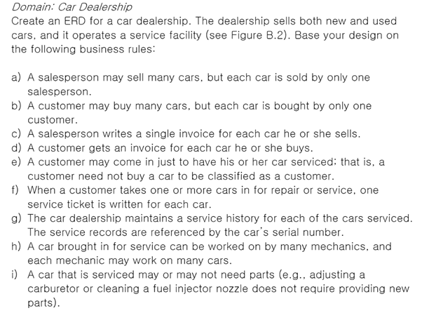
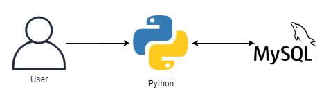
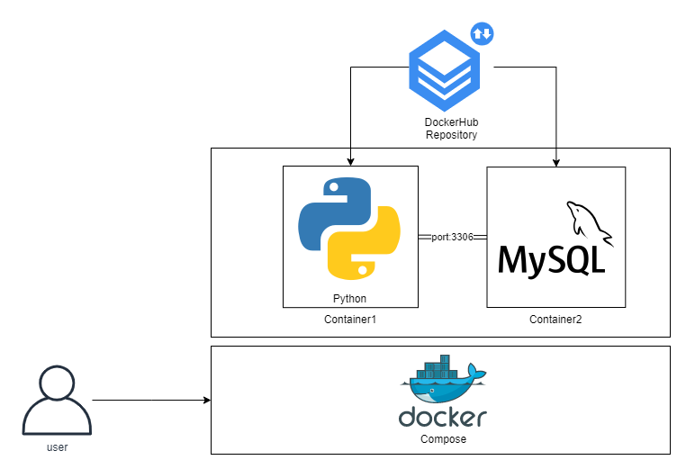
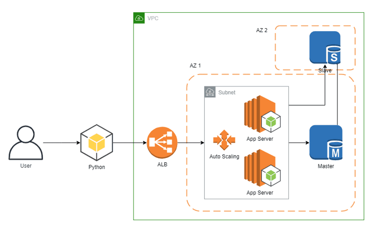
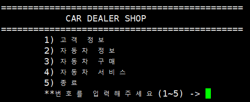
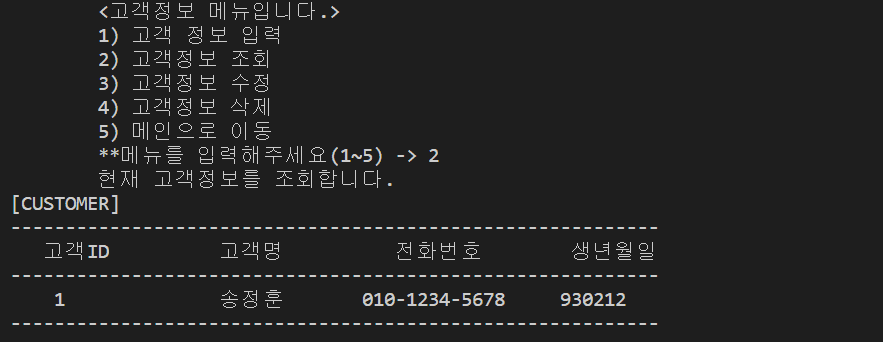
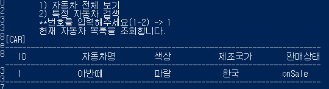
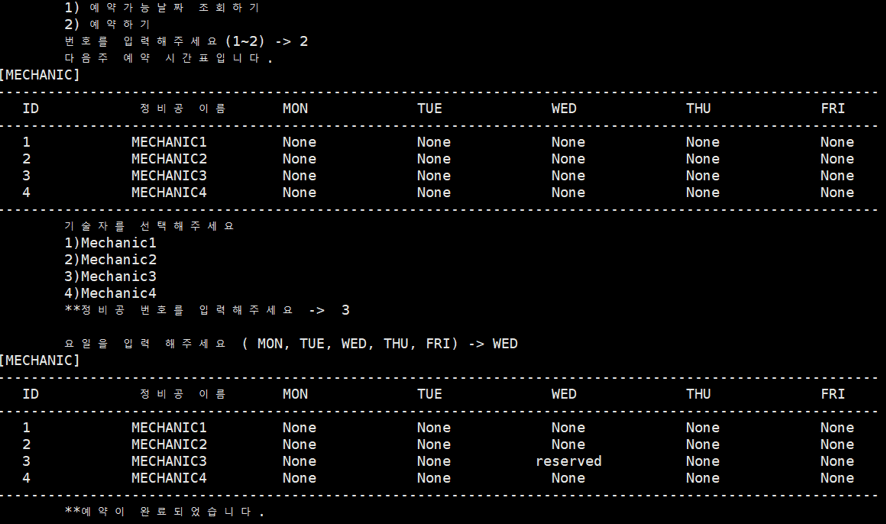

# CarDealership - 자동차 대리점 서버 구축

### 요구사항

 

위 자동차 대리점의 요구사항의 CRUD를 로컬, Docker, AWS에서 구축해보는 것이 이번 토이프로젝트의 목적이었습니다.

 

자세한 구축 내용은 아래 링크에서 확인할 수 있습니다.

목표1 : 로컬에서 MySQL, python으로 CRUD 쿼리 처리 가능한 아키텍처 구축

1. [개요 및 MySQL Workbench를 이용하여 DataBase 쿼리 생성](https://jeonghoon.netlify.app/Project/miniproject/mini_query/)
2. [Python으로 클라이언트 용 스크립트 작성](https://jeonghoon.netlify.app/Project/miniproject/mini_python/)

목표 2 : Docker로 MySQL, python 이미지 생성 후 compose 구성

1. [MySQL, Python 이미지 생성 / compose.yml 작성 및 구축(1)](https://jeonghoon.netlify.app/Project/miniproject/mini_docker_images/)
2. [MySQL, Python 이미지 생성 / compose.yml 작성 및 구축(2)](https://jeonghoon.netlify.app/Project/miniproject/mini_docker_compose/)

목표 3 : AWS, node.js를 추가하여 자동 확장 가능한 3티어 아키텍처 구축

1. [RDS - Master, slave 생성](https://jeonghoon.netlify.app/Project/miniproject/mini_rds/)
2. [**RDS와 클라이언트 연결하는 Rest API node 서버 만들기**](https://jeonghoon.netlify.app/Project/miniproject/mini_node/)
3. [**AutoScaling 그룹 생성 및 ELB(elastic Load Balancer) 연결**](https://jeonghoon.netlify.app/Project/miniproject/mini_autoscaling/)

 

### 1. 로컬에서 MySQL, Python으로 CRUD 쿼리 처리 가능한 아키텍처 구축

로컬에서 웹/앱 처리를 같이 하는 서버를 파이썬으로 만들고, MySQL과 연동시켰습니다. 

 

### 2. Docker로 MySQL, Python 이미지 생성 후 compose 구성

로컬에서 작업한 내용을 가지고 파이썬과 MySQL 컨테이너 이미지를 생성 후 DockerHub에 올렸습니다. 그리고 Docker compose용 yml파일로 이미지를 다운로드하고 단일 호스트를 구축하게 만들었습니다.

 

### 3. AWS에서 자동 확장 가능한 아키텍처 구축. Node를 사용하여 웹서버와 앱서버 구분

마지막으로, 기존 파이썬 파일을 분할하여 파이썬으로 웹서버를 구현하고, Node로 애플리케이션 서버를 만들었습니다. 애플리케이션 서버는 EC2 인스턴스 안에 만들었고, 가용성을 위해 애플리케이션 로드밸런서와 함께 Auto Scaling을 적용하였습니다. 데이터베이스는 RDS를 사용하였으며, 읽기전용 Slave를 만들어 부하를 분산시켰습니다. 

 

### 4. 실행화면

로컬, Docker, AWS에서 실행화면은 동일하며, 아래와 같이 다섯가지 메뉴로 구성되어 있습니다.

### 고객정보

고객정보를 CRUD 할 수 있습니다.

 

### 자동차 정보

등록된 자동차를 조회합니다.

 

### 자동차 구매

자동차의 ID와 고객의 ID, 판매원의 ID를 입력하고 자동차 구매가 가능합니다. 구매된 자동차의 상태는 Solved로 변경됩니다.

 

### 자동차 서비스

예약가능한 날짜를 조회하고 예약합니다. 예약이 되어있다면 해당 날짜는 예약할 수 없습니다.

